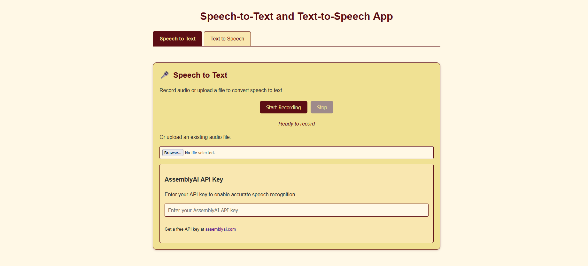

# speechToText
# Speech-to-Text and Text-to-Speech Web Application

A comprehensive web application that allows users to convert speech to text and text to speech directly in the browser. The application features a beautiful burgundy and gold color theme and integrates with AssemblyAI for professional-grade speech recognition.



## Features

### Speech-to-Text
- Record audio directly from your microphone
- Upload existing audio files
- Professional transcription using AssemblyAI's API
- Copy transcribed text to clipboard
- Seamless integration with the Text-to-Speech functionality

### Text-to-Speech
- Convert text to spoken audio using browser's built-in speech synthesis
- Multiple voice options based on your system's available voices
- Adjustable speech rate and pitch
- Pause, resume, and stop speech playback
- Download text as a file (simulated MP3 download)

## Getting Started

### Prerequisites
- Modern web browser (Chrome, Firefox, Edge recommended)
- AssemblyAI API key for speech-to-text functionality
- Microphone access (for recording)

### Installation
1. Clone the repository:
   ```
   git clone https://github.com/yourusername/speech-text-app.git
   ```

2. Open `index.html` in your browser.

3. For speech-to-text functionality, sign up for a free API key at [AssemblyAI](https://www.assemblyai.com/).

## How to Use

### Speech-to-Text
1. Enter your AssemblyAI API key in the provided field
2. Click "Start Recording" or upload an audio file
3. Click "Transcribe" to convert the speech to text
4. Use the "Copy Text" button or "Use in Text-to-Speech" to continue working with your text

### Text-to-Speech
1. Enter or paste the text you want to convert to speech
2. Select a voice from the dropdown menu
3. Adjust speed and pitch as desired
4. Click "Speak" to hear the text spoken
5. Use the Pause/Resume and Stop buttons to control playback

## Key Components

### Important Files
- `index.html` - Main application HTML
- `styles.css` - Application styling
- `script.js` - Application logic

### Key JavaScript Functions

#### Speech-to-Text
- `recordButton.addEventListener('click', async () => {...})` - Handles microphone recording
- `addRecordingToList(blob, url)` - Adds recordings to the UI
- `transcribeAudio(audioBlob, container)` - Sends audio to AssemblyAI for transcription

#### Text-to-Speech
- `populateVoiceList()` - Loads available voices
- `speakButton.addEventListener('click', () => {...})` - Handles text-to-speech conversion
- `pauseResumeButton.addEventListener('click', () => {...})` - Controls speech playback

## Implementation Details

### Speech-to-Text Process
1. Record audio using the browser's MediaRecorder API
2. Upload the audio to AssemblyAI
3. Request transcription
4. Poll for completion
5. Display the transcribed text

```javascript
// Key API calls to AssemblyAI
const uploadResponse = await fetch('https://api.assemblyai.com/v2/upload', {
    method: 'POST',
    headers: { 'authorization': apiKey },
    body: audioBlob
});

const transcriptResponse = await fetch('https://api.assemblyai.com/v2/transcript', {
    method: 'POST',
    headers: {
        'authorization': apiKey,
        'content-type': 'application/json'
    },
    body: JSON.stringify({
        audio_url: audioUrl,
        language_code: 'en_us'
    })
});
```

### Text-to-Speech Process
Uses the Web Speech API's SpeechSynthesis interface to convert text to speech.

```javascript
// Create and configure a speech utterance
const utterance = new SpeechSynthesisUtterance(text);
utterance.voice = selectedVoice;
utterance.rate = rate;
utterance.pitch = pitch;

// Start speaking
speechSynthesis.speak(utterance);
```

## Browser Compatibility

The application relies on the following browser APIs:
- MediaRecorder API for recording audio
- Web Speech API (SpeechSynthesis) for text-to-speech
- Fetch API for network requests

Best performance and compatibility in Chrome, Edge, and Firefox.

## Credits

- Speech recognition powered by [AssemblyAI](https://www.assemblyai.com/)
- Text-to-speech powered by the Web Speech API

## License

This project is licensed under the MIT License - see the LICENSE file for details.

## Acknowledgments

- Color scheme: Deep burgundy (#5C0E14) and warm gold (#F0E193)
- Icons and design inspiration from material design principles


## Credits

- Speech recognition powered by [AssemblyAI](https://www.assemblyai.com/)
- Text-to-speech powered by the Web Speech API
- Application developed with assistance from [Claude](https://claude.ai), an AI assistant by Anthropic
- Reference from [Github](https://github.com/coqui-ai/TTS), about TTS (https://docs.coqui.ai/en/latest/)
- Youtube (https://youtu.be/V2mc13a6eo0?si=WwfrzlaAB_791EUy)


## License

This project is licensed under the MIT License - see the LICENSE file for details.

## Acknowledgments

- Color scheme: Deep burgundy (#5C0E14) and warm gold (#F0E193)
- Icons and design inspiration from material design principles
- Special thanks to Claude for code generation and documentation assistance


